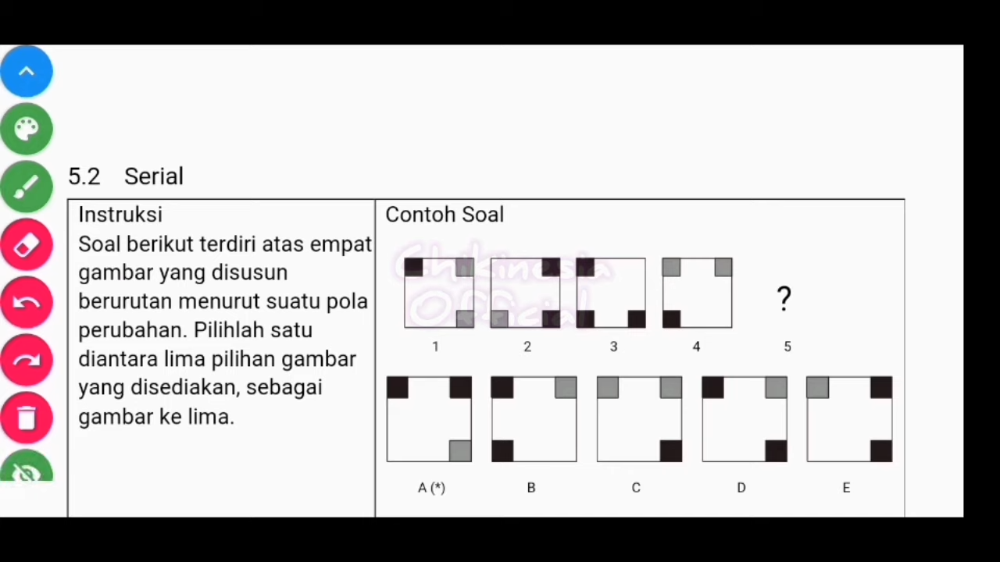

1. forecourt = open area in front a large building
2. pond = a small body of still water formed
3. mausoleum
4. junction =
5. negligible amount
6. amount of electriicity _produced_
7. source of / provided / generating
8. means of electricty generation
9. over a period of/ over the period shown
10. _by far_ the most important
11. a _negligible_ amount
12. nuclear power _overtook_ thermal power
13. _as the primary source_ of electricty
14. rose dramatically to _a peak of_
15. by contrast
16. the figure for
17. remained at this level, remained stable
18. _saw_ only a small rise

