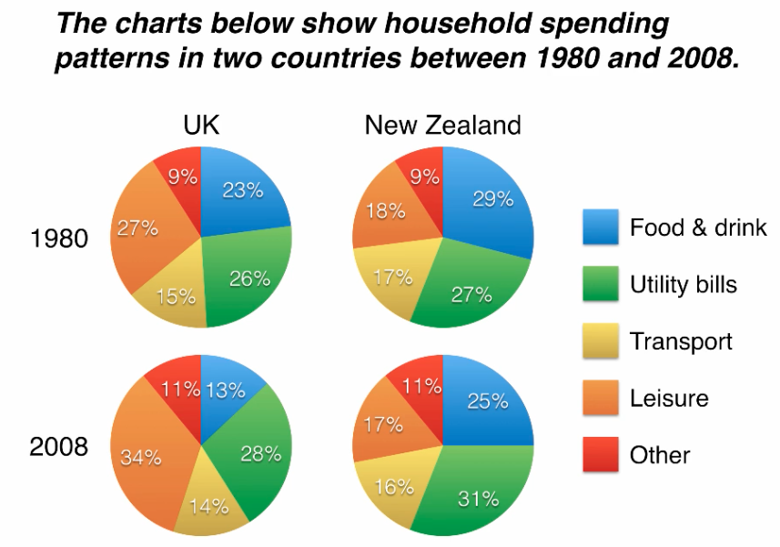

## writing task pie chart

The pie charts compare five categories of household expnditure in the UK and New Zaealand in the years 1980 and 2008.

It is noticeable that the proportion of spending on food and drink fell in both countries over the 28-year period, while spending on utility bills rose. Also, UK residents spent a significantly larger percetage of their household budget on leisure than their New Zaeland counterparts.

In 1980, 29% of avarage New Zaeland household budget went on food and drink, while the equivalent figure for a UK home was 23%. By 2008, expenditure on food and drink had fallen by 4% in New Zealand, and by a full 10% in the UK. By contrast, both countries saw an increase in expenditure on utility bills for the average home, from 27% to 31% in New Zealand and from 26% to 28% in the UK.

Leisure activities accounted for the highest proportion of UK household spending in both years, but only the third highest proportion in New Zealand. In fact, in 2008, New Zealanders spent only half as much in relative terms on recreation (17%) as UK residents (34%). In both countries, transport costs and other costs took roughly 15% and 10% of household budgets respectively.
