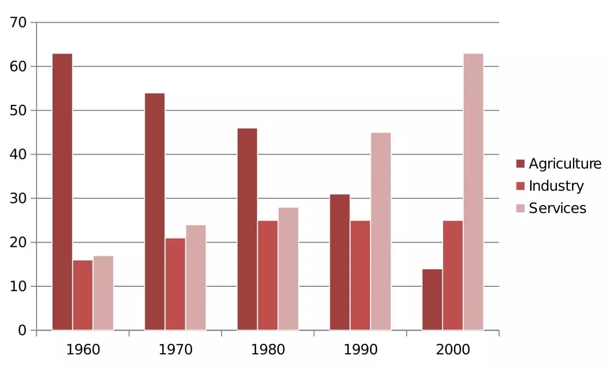

The bar chart below shows the sector contributions to India’s gross domestic product from 1960 to 2000.

Summarise the information by selecting and reporting the main features, and make comparisons where relevant.

Write at least 150 words

Contribution as % of India's GDP

intro

The bar graph illustrates the relative percentage contributions made by the agricultural, industrial and service sectors to the Indian economy between 1960 and 2000.

The chart illustrates the number of sector contribution from Agriculture, Industry, and Services to the gross domestic product (GDP) of India over the period of four decades.

Over the period, agriculture and services saw significantly different trends.

While services sector saw an increase over the period, agriculture saw a decrease of contributions to GDP's of India. Meanwhile, Industry sector seems having fluctuation.

overview

Over the whole time period, the significance of agriculture declined steadily *while* services grew in importance decade by decade. A different patterned emerged for industry, which initially showed a slowly increasing percentage but then plateaued from 1980 onwards.

In 1960, Agriculture saw a significant contribution around 60%. In 2000, the sector of service has the highest contribution which i

Agriculture and services sector has significant contribution

detail1

In 1960, agriculture contributed by far the highest percentage of GDP, peaking at 62%, but it then dropped in steady increments to a low of 12% in 2000. The service sector, on the other hand, had a relatively minor impact on the economy in 1960. This situation changed gradually at first, then its percentage contribution jumped from 28% to 43% between 1980 and 1990. By 2000 it matched the high point reached by agriculture in 1960, showing a reversal in the overall trend.

Agriculture saw the highest contribution of economy around 62% in 1960. However this sector declined steadly over the time period to 12% in 2000. In other hand, Serv

Agriculture start the period with highest controbution to the economy around 62% in 1960. Nevertheless, this sector decline over the period until the year of 2000 with the percentage of 12%.

detail2

Industry remained a steady contributor to India’s wealth throughout the period. As a sector, it grew marginally from 16% in 1960 to exactly a quarter in 1980 then remained static for the next two decades, maintaining a constant share of the overall GDP.

[source:0309](https://www.ieltsjacky.com/ielts-bar-chart.html)
